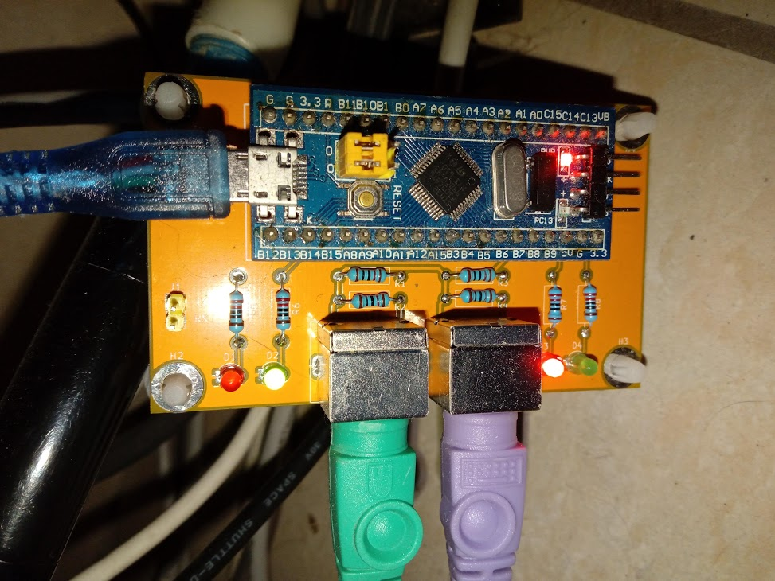

# PS2_to_USB_converter

 This board allow to plus PS/2 devices (keybords or mice) to a computer using a standard USB connector.

- Uses a low cost STM32F103 "bluepill"
- Two independent PS/2 ports
- Each port can be connected to a mouse, a keyboard or left unconnected. The connected devices are automatically presented to the host computer
- Automatic recognition of the type of the PS/2 device : you can connect any keyboard or mouse on each of the PS/2 connector of the board
- No specific driver required on host computer
- Hardware and Firmware source code provided
- 2 leds per port for PS/2 device type identification and traffic information

Directories:
- din2usb_adapter contains the KICAD files of the board.
- stm103_ps2_to_usb contains the firmware.
